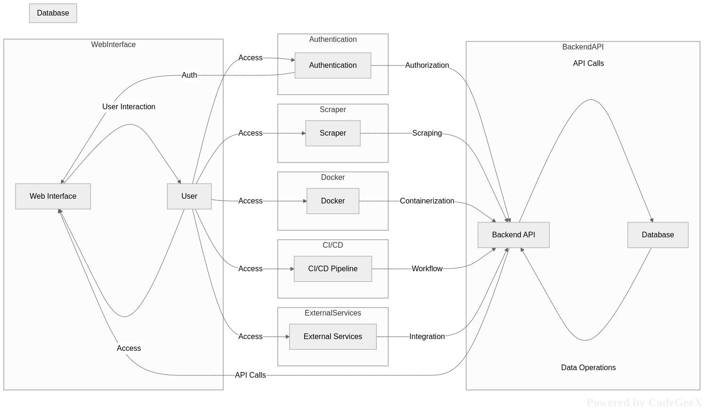

以下是每个文件的功能说明：

### 根目录

- `api-website`
  - `index.html`: API文档的HTML入口文件。
  - `openapi.yaml`: OpenAPI规范的YAML文件，用于描述API接口。
- `CHANGELOG.md`: 项目的更新日志。
- `database`
  - `init.db.go`: 初始化数据库的脚本。
  - `migration.go`: 数据库迁移脚本。
  - `operations.go`: 数据库操作相关的函数。
- `Dockerfile`: 用于构建Docker镜像的文件。
- `docs`
  - `notes.md`: 项目相关的笔记。
  - `structure.md`: 项目结构的文档。
  - `structure.txt`: 项目结构的文本描述文件。
- `go.mod`: Go语言的依赖管理文件。
- `goscraper`
  - `goscraper.go`: 爬虫的主要逻辑。
- `go.sum`: Go语言的依赖锁定文件。
- `handler`
  - `handlers.go`: HTTP请求处理函数。
- `images`
  - `admin.jpg`: 管理页面的背景图片。
  - `login.jpg`: 登录页的背景图片。
  - `pad-dark.png`: 暗黑模式下的平板图片。
  - `pad-light.png`: 浅色模式下的平板图片。
  - `pad_preview.png`: 平板预览图片。
  - `pc-dark.png`: 暗黑模式下的电脑图片。
  - `pc-light.png`: 浅色模式下的电脑图片。
  - `pc_preview.png`: 电脑预览图片。
  - `phone-dark.png`: 暗黑模式下的手机图片。
  - `phone-light.png`: 浅色模式下的手机图片。
  - `phone_preview.png`: 手机预览图片。
  - `qqqun.jpg`: QQ群的宣传图片。
- `LICENSE`: 项目的许可证文件。
- `logger`
  - `log.go`: 日志记录的函数和配置。
- `main.go`: 项目的入口文件。
- `Makefile`: 包含项目的构建和管理命令。
- `middleware`
  - `auth.go`: 认证中间件。
- `README.md`: 项目的说明文档。
- `serve.go`: 启动HTTP服务器的脚本。
- `service`
  - `auth.go`: 认证相关的业务逻辑。
  - `catelog.go`: 目录相关的业务逻辑。
  - `image.go`: 图片相关的业务逻辑。
  - `import.go`: 导入相关的业务逻辑。
  - `settings.go`: 设置相关的业务逻辑。
  - `tools.go`: 工具相关的业务逻辑。
- `types`
  - `dto.go`: 数据传输对象（DTO）的定义。
  - `types.go`: 其他数据类型的定义。
- `ui`
  - `package.json`: 前端项目的依赖管理文件。
  - `pnpm-lock.yaml`: pnpm的依赖锁定文件。
  - `postcss.config.js`: PostCSS的配置文件。
  - `public`
    - `baidu.ico`: 百度favicon。
    - `bg.webp`: 背景图片。
    - `bing.ico`: Bing favicon。
    - `google.ico`: Google favicon。
    - `image.png`: 通用图片。
    - `index.html`: 前端项目的HTML入口文件。
    - `logo192.png` 和 `logo512.png`: Logo图片。
    - `manifest.json`: Web应用的清单文件。
    - `robots.txt`: 爬虫协议文件。
  - `src`
    - `App.css`: 应用全局样式。
    - `App.test.tsx`: 应用的测试文件。
    - `App.tsx`: 应用的主组件。
    - `components`: 前端组件。
      - `CardV2`: 卡片组件。
      - `Content`: 内容组件。
      - `DarkSwitch`: 暗黑模式切换组件。
      - `GithubLink`: GitHub链接组件。
      - `Loading`: 加载组件。
      - `SearchBar`: 搜索栏组件。
      - `TagSelector`: 标签选择器组件。
    - `index.css`: 全局样式。
    - `index.tsx`: 入口组件。
    - `pages`: 前端页面。
      - `admin`: 管理页面。
        - `components`: 管理页面的组件。
          - `sidebar.tsx`: 侧边栏组件。
        - `hooks`: 自定义钩子。
          - `useData.tsx`: 数据钩子。
        - `index.css`: 管理页面的样式。
        - `index.tsx`: 管理页面的主组件。
        - `tabs`: 管理页面的标签页。
          - `ApiToken.tsx`: API令牌页。
          - `Catelog.tsx`: 目录页。
          - `Search.tsx`: 搜索页。
          - `Setting.tsx`: 设置页。
          - `Tools.tsx`: 工具页。
      - `Home.tsx`: 主页。
      - `Login.css`: 登录页样式。
      - `Login.tsx`: 登录页。
    - `react-app-env.d.ts`: React应用的环境声明文件。
    - `router.tsx`: 路由配置。
    - `serviceWorker.ts`: 服务工作者配置。
    - `setupTests.ts`: 测试环境配置。
    - `utils`: 前端工具函数。
      - `admin.ts`: 管理工具函数。
      - `api.tsx`: API工具函数。
      - `check.ts`: 检查工具函数。
      - `serachEngine.ts`: 搜索引擎工具函数。
      - `setting.ts`: 设置工具函数。
      - `theme.ts`: 主题工具函数。
      - `tools.ts`: 工具函数。
      - `touch.ts`: 触摸工具函数。
      - `useOnce.ts`: 一次性使用工具函数。
  - `sw-config.js`: 服务工作者配置文件。
  - `tailwind.config.js`: Tailwind CSS的配置文件。
  - `tsconfig.json`: TypeScript的配置文件。
  - `workbox-config.js`: Workbox的配置文件。
- `utils`
  - `jwt.go`: JWT相关的工具函数。
  - `utils.go`: 其他通用工具函数。

这个项目结构清晰，将后端和前端的代码分开管理，便于维护和扩展。
